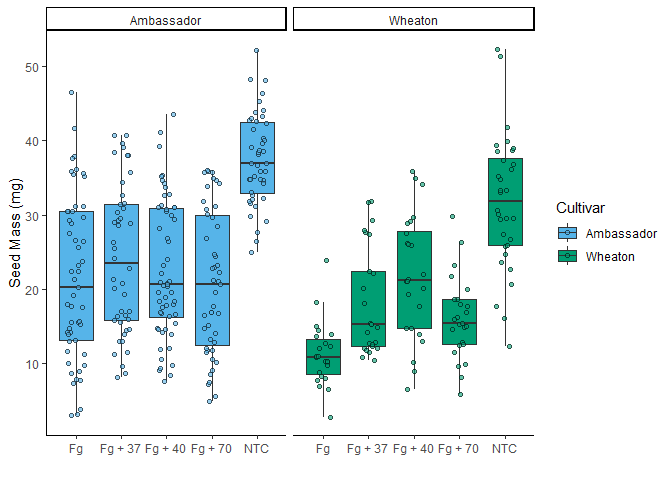

# Coding Challenge 4

## Question 2 - Source Manuscript

1.  *At the top of the document, make a clickable link to the manuscript
    where these data are published.*

[Noel, Z.A., Roze, L.V., Breunig, M., Trail, F. 2022. Endophytic fungi
as promising biocontrol agent to protect wheat from Fusarium graminearum
head blight. Plant Disease.
https://doi.org/10.1094/PDIS-06-21-1253-RE](https://doi.org/10.1094/PDIS-06-21-1253-RE)

## Question 1

*Define the following:*

- **YAML header** is a section of text at the top of an Rmarkdown file
  that gives info about the title, author, and date of the Rmd file, but
  the output section also determines the final file format, such as an
  HTML, word, or PDF document.
- **Literate programming** in R markdown files is the concept of
  combining R code with natural language, such as English. This allows
  the user to explain how their code works in a common language, while
  also executing code chunks.

## Question 2 (b&c)

*Take the code you wrote for coding challenge 3, question 5, and
incorporate it into your R markdown file. Some of you have already been
doing this, which is great! Your final R markdown file should have the
following elements.*

2.  *Read the data using a relative file path with na.strings option set
    to “na”. This means you need to put the Mycotoxin.csv file we have
    used for the past two weeks into your directory, which git tracks. *
3.  *Make a separate code chunk for the figures plotting the DON data,
    15ADON, and Seedmass, and one for the three combined using
    ggarrange. *

``` r
#Calling in packages
library(ggplot2)
library(ggpubr)
library(ggrepel)
library(tinytex)
library(knitr)
library(rmarkdown)
library(pandoc)
```

    ## 
    ## Attaching package: 'pandoc'

    ## The following objects are masked from 'package:rmarkdown':
    ## 
    ##     pandoc_available, pandoc_convert, pandoc_version

``` r
#Question 2. Part a. Calling in Dataset 
MycotoxinData <- read.csv("MycotoxinData.csv",na.strings="na")

#Call in Color Blind Palette for ggplot 
cbbPalette <- c("#E69F00", "#56B4E9", "#009E73", "#F0E442", "#0072B2", "#D55E00", "#CC79A7","#000000")
```

### Plotting DON x Treatment

``` r
DON <- ggplot(MycotoxinData, aes(x=Treatment, y=DON, fill=Cultivar)) + 
  geom_boxplot(outlier.shape=NA) + 
  geom_point(position = position_jitterdodge(dodge.width=0.9), shape=21,alpha=0.6)+ #jitter dodge points and make them transparent
  scale_fill_manual(values = c(cbbPalette[[2]],cbbPalette[[3]]))+ #manually insert two colors from CbbPalette
  xlab("")+ #label x-axis
  ylab("DON (ppm)")+ #label y-axis
  theme_classic() + #classic theme
  facet_wrap(~Cultivar) #facet by Cultivar
DON
```

    ## Warning: Removed 8 rows containing non-finite outside the scale range
    ## (`stat_boxplot()`).

    ## Warning: Removed 8 rows containing missing values or values outside the scale range
    ## (`geom_point()`).

<!-- -->

### Plotting X15ADON x Treatment

``` r
X15ADON <- ggplot(MycotoxinData, aes(x=Treatment, y=X15ADON, fill=Cultivar)) + 
  geom_boxplot(outlier.shape=NA) + 
  geom_point(position = position_jitterdodge(dodge.width=0.9), shape=21,alpha=0.6)+ #jitter dodge points and make them transparent
  scale_fill_manual(values = c(cbbPalette[[2]],cbbPalette[[3]]))+ #manually insert two colors from CbbPalette
  xlab("")+ #label x-axis
  ylab("15ADON")+ #label y-axis
  theme_classic() + #classic theme
  facet_wrap(~Cultivar) #facet by Cultivar
X15ADON
```

    ## Warning: Removed 10 rows containing non-finite outside the scale range
    ## (`stat_boxplot()`).

    ## Warning: Removed 10 rows containing missing values or values outside the scale range
    ## (`geom_point()`).

<!-- -->

### Plotting MassperSeed_mg x Treatment

``` r
MassperSeed <- ggplot(MycotoxinData, aes(x=Treatment, y=MassperSeed_mg, fill=Cultivar)) + 
  geom_boxplot(outlier.shape=NA) + 
  geom_point(position = position_jitterdodge(dodge.width=0.9), shape=21,alpha=0.6)+ #jitter dodge points and make them transparent
  scale_fill_manual(values = c(cbbPalette[[2]],cbbPalette[[3]]))+ #manually insert two colors from CbbPalette
  xlab("")+ #label x-axis
  ylab("Seed Mass (mg)")+ #label y-axis
  theme_classic() + #classic theme
  facet_wrap(~Cultivar) #facet by Cultivar
MassperSeed
```

    ## Warning: Removed 2 rows containing non-finite outside the scale range
    ## (`stat_boxplot()`).

    ## Warning: Removed 2 rows containing missing values or values outside the scale range
    ## (`geom_point()`).

<!-- -->

### Statistical Tests and Final Figure

*Use geom_pwc() to add t.test pairwise comparisons to the three plots
made above. Combine three figures into group via ggarrange*

``` r
#Calculating t-tests for the three figures 
Stat1 <-  DON +
  geom_pwc(aes(group=Treatment), method = "t_test",label = "p.adj.format") #Adding t-test to Question 1 figure

Stat2 <- X15ADON +
  geom_pwc(aes(group=Treatment),method = "t_test",label = "p.adj.format")  #Adding t-test to Question 2 figure

Stat3 <- MassperSeed +
  geom_pwc(aes(group=Treatment),method = "t_test",label = "p.adj.format")  #Adding t-test to Question 3 figure

#Plotting three figures with t-test calculations 
figure1 <- ggarrange(
  Stat1,  # First plot: water.imbibed
  Stat2,  # Second plot: bac.even
  Stat3,  # Third plot: water.imbibed.cor
  labels = "auto",  # Automatically label the plots (A, B, C, etc.)
  nrow = 1,  # Arrange the plots in 3 rows
  ncol = 3,  # Arrange the plots in 1 column
  common.legend = TRUE  # Do not include a legend in the combined figure
)
```

    ## Warning: Removed 8 rows containing non-finite outside the scale range
    ## (`stat_boxplot()`).

    ## Warning: Removed 8 rows containing non-finite outside the scale range
    ## (`stat_pwc()`).

    ## Warning: Removed 8 rows containing missing values or values outside the scale range
    ## (`geom_point()`).

    ## Warning: Removed 8 rows containing non-finite outside the scale range
    ## (`stat_boxplot()`).

    ## Warning: Removed 8 rows containing non-finite outside the scale range
    ## (`stat_pwc()`).

    ## Warning: Removed 8 rows containing missing values or values outside the scale range
    ## (`geom_point()`).

    ## Warning: Removed 10 rows containing non-finite outside the scale range
    ## (`stat_boxplot()`).

    ## Warning: Removed 10 rows containing non-finite outside the scale range
    ## (`stat_pwc()`).

    ## Warning: Removed 10 rows containing missing values or values outside the scale range
    ## (`geom_point()`).

    ## Warning: Removed 2 rows containing non-finite outside the scale range
    ## (`stat_boxplot()`).

    ## Warning: Removed 2 rows containing non-finite outside the scale range
    ## (`stat_pwc()`).

    ## Warning: Removed 2 rows containing missing values or values outside the scale range
    ## (`geom_point()`).

``` r
figure1
```

<!-- -->

## Question 3

*Knit your document together in the following formats:* a. *.docx (word
document) OR .pdf with a table of contents* b. *GitHub flavored markdown
(.md file).*

This document is knitted as a PDF file and GitHub flavored markdown file
as seen in the output in the YAML header.

## Question 4

*Push the .docx or .pdf and .md files to GitHub inside a directory
called Coding Challenge 4.*

The Coding Challenge 4 file now lives in my GitHub with a .pdf and .md
version of this document. The link will be provided in Question 6.

## Question 5

*Now edit, commit, and push the README file for your repository and
include the following elements.* a. *A clickable link in your README to
your GitHub flavored .md file* b. *A file tree of your GitHub
repository.*

The README file now lives in my PLPA6820 repository with a clickable
link to the .md version of this assignment and a file tree of my
PLPA6820 repository.

## Question 6

*Please provide me a clickable link to your GitHub*

[**Link to my Github**](https://github.com/kzb0180/PLPA6820)

**Note:** I had my repository saved as private and switched it to
public. I have added you as a collaborator just in case.When I tried
this link it didn’t work, but it is correct. Here is the link typed out
as well: <https://github.com/kzb0180/PLPA6820>. Once I incorporate my
lab’s data I will have to switch the repository back to private.
