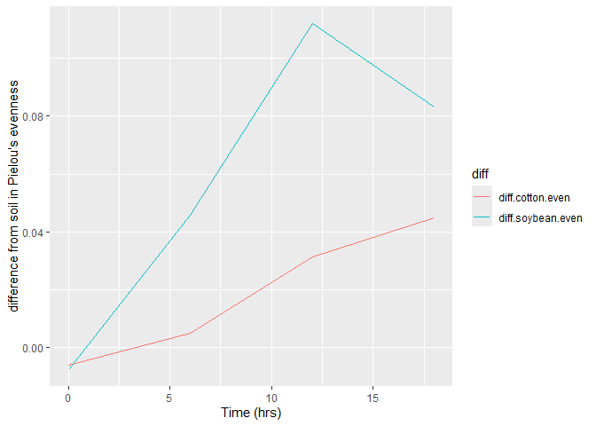

# Question 1

**1. 3 pts. Download two .csv files from Canvas called DiversityData.csv
and Metadata.csv, and read them into R using relative file paths.**

``` r
#Loading in necessary packages
library(tidyverse)
```

    ## ── Attaching core tidyverse packages ──────────────────────── tidyverse 2.0.0 ──
    ## ✔ dplyr     1.1.4     ✔ readr     2.1.5
    ## ✔ forcats   1.0.0     ✔ stringr   1.5.1
    ## ✔ ggplot2   3.5.1     ✔ tibble    3.2.1
    ## ✔ lubridate 1.9.4     ✔ tidyr     1.3.1
    ## ✔ purrr     1.0.2     
    ## ── Conflicts ────────────────────────────────────────── tidyverse_conflicts() ──
    ## ✖ dplyr::filter() masks stats::filter()
    ## ✖ dplyr::lag()    masks stats::lag()
    ## ℹ Use the conflicted package (<http://conflicted.r-lib.org/>) to force all conflicts to become errors

``` r
library(ggplot2)

#Loading in DiversityData and Metadata
Metadata <- read.csv("CodingChallenge5//Metadata.csv", na.strings = "na")
DiversityData <-  read.csv("CodingChallenge5//DiversityData.csv")
```

# Question 2

**2. 4 pts. Join the two dataframes together by the common column
‘Code’. Name the resulting dataframe alpha.**

``` r
#Combining the two datasets by column "Code"
alpha <- left_join(Metadata,DiversityData, by = "Code")
head(alpha) #viewing first few rows of dataframe
```

    ##     Code Crop Time_Point Replicate Water_Imbibed  shannon invsimpson   simpson
    ## 1 S01_13 Soil          0         1            NA 6.624921   210.7279 0.9952545
    ## 2 S02_16 Soil          0         2            NA 6.612413   206.8666 0.9951660
    ## 3 S03_19 Soil          0         3            NA 6.660853   213.0184 0.9953056
    ## 4 S04_22 Soil          0         4            NA 6.660671   204.6908 0.9951146
    ## 5 S05_25 Soil          0         5            NA 6.610965   200.2552 0.9950064
    ## 6 S06_28 Soil          0         6            NA 6.650812   199.3211 0.9949830
    ##   richness
    ## 1     3319
    ## 2     3079
    ## 3     3935
    ## 4     3922
    ## 5     3196
    ## 6     3481

# Question 3

**3. 4 pts. Calculate Pielou’s evenness index: Pielou’s evenness is an
ecological parameter calculated by the Shannon diversity index (column
Shannon) divided by the log of the richness column.** **a. Using mutate,
create a new column to calculate Pielou’s evenness index.** **b. Name
the resulting dataframe alpha_even.**

``` r
#Creating Pielous's evenness index column, named PEI
alpha_even <- mutate(alpha, PEI = shannon/log(richness))
head(alpha_even) #viewing first few rows of dataframe
```

    ##     Code Crop Time_Point Replicate Water_Imbibed  shannon invsimpson   simpson
    ## 1 S01_13 Soil          0         1            NA 6.624921   210.7279 0.9952545
    ## 2 S02_16 Soil          0         2            NA 6.612413   206.8666 0.9951660
    ## 3 S03_19 Soil          0         3            NA 6.660853   213.0184 0.9953056
    ## 4 S04_22 Soil          0         4            NA 6.660671   204.6908 0.9951146
    ## 5 S05_25 Soil          0         5            NA 6.610965   200.2552 0.9950064
    ## 6 S06_28 Soil          0         6            NA 6.650812   199.3211 0.9949830
    ##   richness       PEI
    ## 1     3319 0.8171431
    ## 2     3079 0.8232216
    ## 3     3935 0.8046776
    ## 4     3922 0.8049774
    ## 5     3196 0.8192376
    ## 6     3481 0.8155427

# Question 4

**4. 4. Pts. Using tidyverse language of functions and the pipe, use the
summarise function and tell me the mean and standard error evenness
grouped by crop over time.** **a. Start with the alpha_even dataframe**
**b. Group the data: group the data by Crop and Time_Point.**
**c. Summarize the data: Calculate the mean, count, standard deviation,
and standard error for the even variable within each group.**

``` r
#caluculate summary statistics for evenness grouped by crop over time
alpha_average <-  alpha_even %>% 
  group_by(Crop, Time_Point) %>% #viewing data grouped by crop and time_point
  summarise(mean.even = mean(PEI), #calculate mean evenness
            count = n(), #count number of values by crop over time
            sd.even = sd(PEI), #calculate std dev evenness
            se.even = sd.even/sqrt(count)) #calculate std error evenness
```

    ## `summarise()` has grouped output by 'Crop'. You can override using the
    ## `.groups` argument.

``` r
head(alpha_average) #view some of the resulting alpha_average dataframe
```

    ## # A tibble: 6 × 6
    ## # Groups:   Crop [2]
    ##   Crop   Time_Point mean.even count sd.even se.even
    ##   <chr>       <int>     <dbl> <int>   <dbl>   <dbl>
    ## 1 Cotton          0     0.820     6 0.00556 0.00227
    ## 2 Cotton          6     0.805     6 0.00920 0.00376
    ## 3 Cotton         12     0.767     6 0.0157  0.00640
    ## 4 Cotton         18     0.755     5 0.0169  0.00755
    ## 5 Soil            0     0.814     6 0.00765 0.00312
    ## 6 Soil            6     0.810     6 0.00587 0.00240

# Question 5

**5. 4. Pts. Calculate the difference between the soybean column, the
soil column, and the difference between the cotton column and the soil
column** **a. Start with the alpha_average dataframe** **b. Select
relevant columns: select the columns Time_Point, Crop, and mean.even.**
**c. Reshape the data: Use the pivot_wider function to transform the
data from long to wide format, creating new columns for each Crop with
values from mean.even.** **d. Calculate differences: Create new columns
named diff.cotton.even and diff.soybean.even by calculating the
difference between Soil and Cotton, and Soil and Soybean,
respectively.** **e. Name the resulting dataframe alpha_average2**

``` r
alpha_average2 <- alpha_average %>% 
  select(Time_Point, Crop, mean.even) %>% #only select the three columns (Time_Point, Crop, mean.even)
  pivot_wider(names_from = Crop, values_from = mean.even) %>%  #put multiple observations in one row for separate columns by Crop
  mutate(diff.cotton.even = Soil - Cotton,
         diff.soybean.even = Soil - Soybean) #create new columns 
head(alpha_average2) #view some of the resulting alpha_average2 dataframe
```

    ## # A tibble: 4 × 6
    ##   Time_Point Cotton  Soil Soybean diff.cotton.even diff.soybean.even
    ##        <int>  <dbl> <dbl>   <dbl>            <dbl>             <dbl>
    ## 1          0  0.820 0.814   0.822         -0.00602          -0.00740
    ## 2          6  0.805 0.810   0.764          0.00507           0.0459 
    ## 3         12  0.767 0.798   0.687          0.0313            0.112  
    ## 4         18  0.755 0.800   0.716          0.0449            0.0833

# Question 6

**6. 4 pts. Connecting it to plots** **a. Start with the alpha_average2
dataframe** **b. Select relevant columns: select the columns Time_Point,
diff.cotton.even, and diff.soybean.even.** **c. Reshape the data: Use
the pivot_longer function to transform the data from wide to long
format, creating a new column named diff that contains the values from
diff.cotton.even and diff.soybean.even.** **i. This might be
challenging, so I’ll give you a break. The code is below.** **d. Create
the plot: Use ggplot and geom_line() with ‘Time_Point’ on the x-axis,
the column ‘values’ on the y-axis, and different colors for each ‘diff’
category. The column named ‘values’ come from the pivot_longer. The
resulting plot should look like the one to the right.**

``` r
alpha_average2 %>% 
  select(Time_Point, diff.cotton.even,diff.soybean.even) %>%#selecting only relevant columns
  pivot_longer(c(diff.cotton.even, diff.soybean.even), names_to = "diff") %>% #putting data in long format 
  ggplot(aes(x = Time_Point, y = value, color = diff)) + # adding in a ggplot
  geom_line() + #make line bar
  xlab("Time (hrs)") + #label x-axis
  ylab("difference from soil in Pielou's evenness") #label y-axis
```

<!-- -->

# Question 7

7.  2 pts. Commit and push a gfm .md file to GitHub inside a directory
    called Coding Challenge 5. Provide me a link to your github written
    as a clickable link in your .pdf or .docx

**[Click here to my GitHub](https://github.com/kzb0180)**
