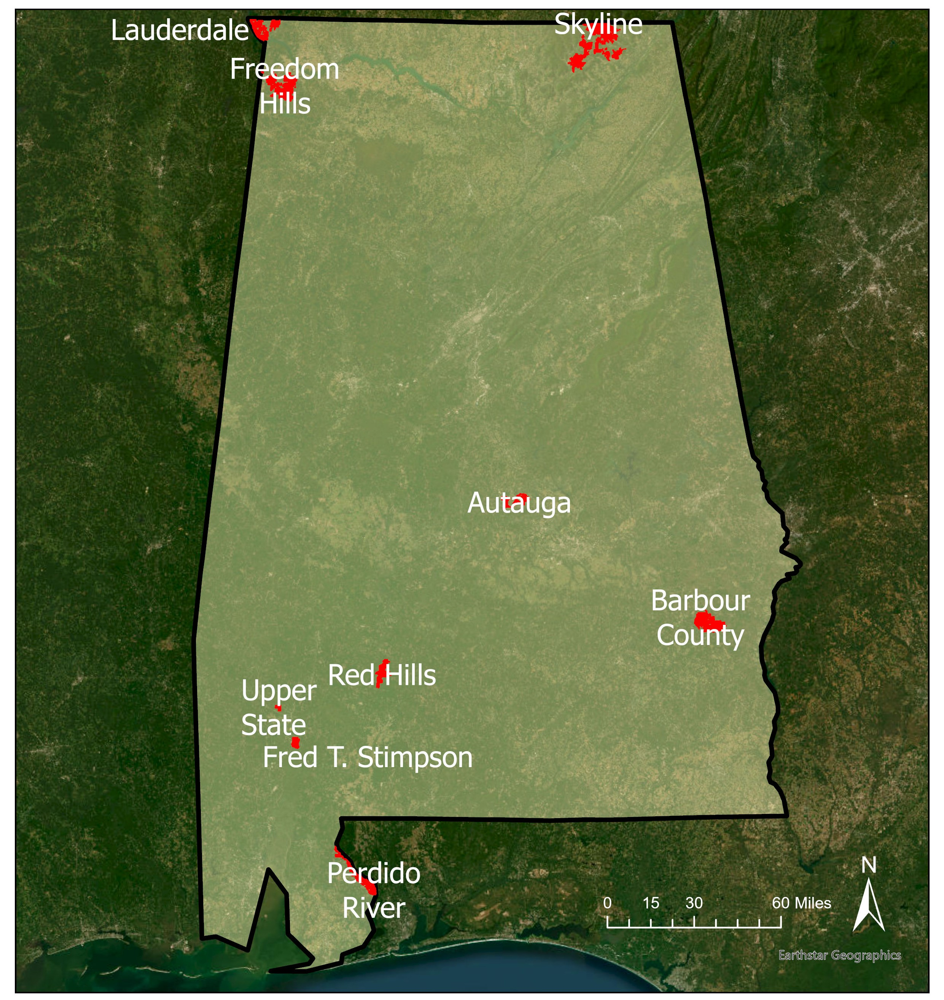
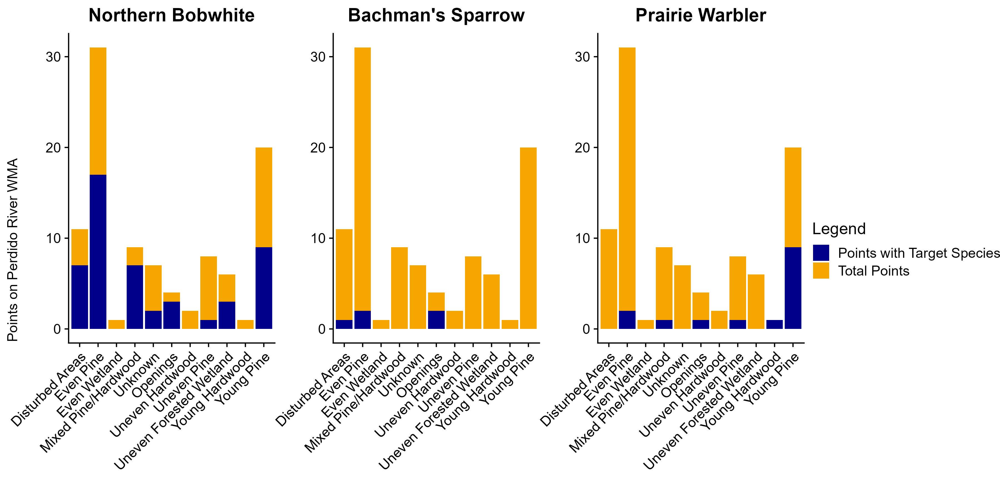
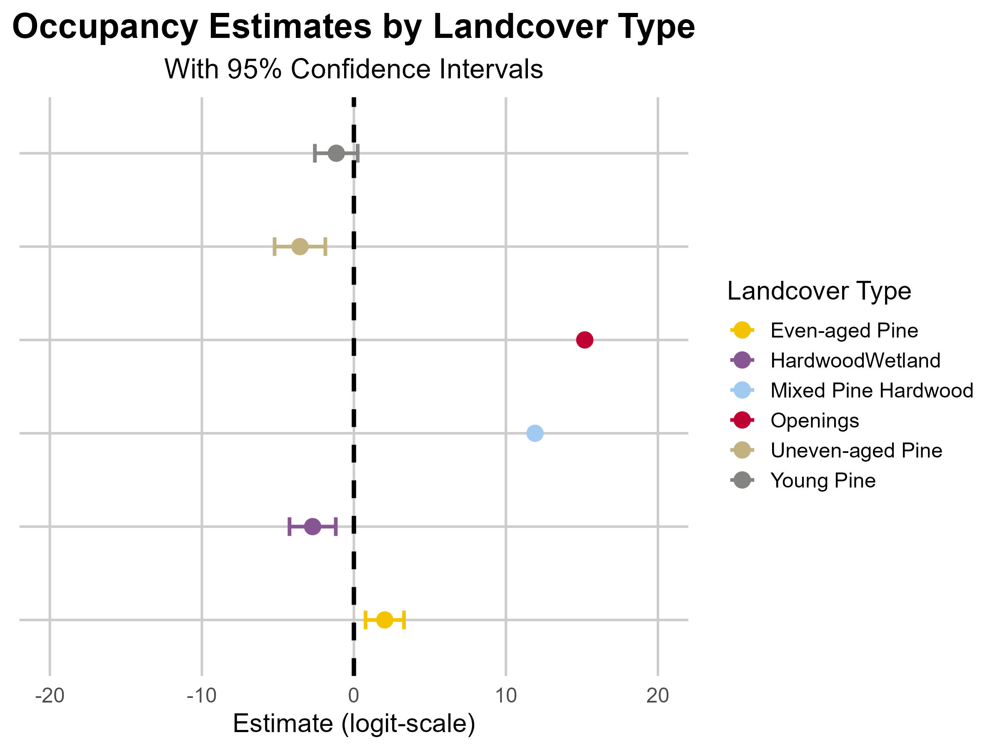

Final project - you are to use your data from your PhD or Master's research or data from a paper you want to reproduce and write a reproducible workflow using these data. 

History of evidence of integration with version control - 10 points 
Creation of figures that are manuscript-ready - 25 points
Use of reproducible and efficient coding techniques like functions, self-checks, R markdown, loops, and data simulation. - 50 points 
Must have a README file - 10 points 
Must be in an R project - 5 points 
I or someone else must be able to download your project. run the code, have it make sense, and reproduce it! - 25 points

##Load in Packages and Excel Workbooks

```{r}
#Load in packages
library(readxl)
library(knitr)
library(dplyr)
library(ggplot2)
library(cowplot)
library(ggpubr)
library(ggrepel)
#library(sf)
#library(rnaturalearth)
library(dplyr)
library(devtools)
library(tidyr)
library(grafify)
library(hms)
library(lubridate) # For handling dates
library(chngpt)    # For threshold regression
library(tibble)
library(stringr)
library(unmarked)
```

##Load in Excel Workbooks and Tidy the Data

```{r}
#Load in necessary workboooks
surveys <- read_excel("FinalProject\\birdsICP2.xlsx",sheet = "surveyLevel")  # Data containing survey-level information
individuals <- read_excel("FinalProject\\birdsICP2.xlsx",sheet = "individualLevel") #Data containing individual-level information
points <- read_excel("FinalProject\\vegICP2.xlsx",sheet = "pointLevel") #Data containing point-level information
detections <- read_excel("FinalProject\\birdsICP2.xlsx",sheet = "detectionLevel") #Data containing detection-level information

detections = detections[, -1] # remove redundant data sheet number
 
# Reshape individuals and detections for later analysis
birds = individuals %>%
  left_join(detections, by = "individualId") %>%
  pivot_wider(names_from = interval, values_from = distanceIcp2)
```

###Tidy Data
Combining 
1. Date and Time Conversion: It converts date and time columns into a single DateTime column, computes hours since midnight, and scales the time of day. Filtering: It filters out surveys conducted before a specific cutoff date (May 13th, 2024).Survey Labeling: It assigns survey labels based on the chronological order within each pointId2.Data Cleaning: It converts 'FLUSHED' values in the 'Time of 1st Detection' column to -1 so the column is read as an integer string.
2. Merge the surveyLevel (bird data) and pointLevel (vegetation data) together by pointId2. Each point had a unique pointId2 that links bird and vegetation data together.
3. Add the individual level species data to the merged data from step 1. merge them by dataSheetNum, which links the Survey Level to individual level. 

```{r}
# Convert date and time columns to single Date Time Column

# Step 1: Convert Date from character to Date format
surveys$date <- as.Date(surveys$date, format = "%d %b %Y")
 
# Convert startTime to time-only format and compute hours since midnight
surveys <- surveys %>%
  mutate(
    timeOnly = format(as.POSIXct(startTime, format="%Y-%m-%d %H:%M:%S"), "%H:%M:%S"),
    hrsSinceMidnight = hour(as.POSIXct(startTime, format="%Y-%m-%d %H:%M:%S")) +
      minute(as.POSIXct(startTime, format="%Y-%m-%d %H:%M:%S")) / 60 +
      second(as.POSIXct(startTime, format="%Y-%m-%d %H:%M:%S")) / 3600,
    scaledTimeOfDay = scale(hrsSinceMidnight, center = TRUE, scale = TRUE)[,1] # Extract numeric value
  )
 
# Filter out surveys before the breeding season cutoff (May 13th, 2024)
cutoff_date <- as.POSIXct("2024-05-13", format = "%Y-%m-%d") # Set cutoff date
surveys <- surveys %>% filter(date > cutoff_date)  # Keep only surveys after the cutoff
 
# Filter the data frame to only include rows where DateTime is later than May 13th, 2024
surveys <- surveys %>%
  filter(date > cutoff_date)

 
# Create a 'DayOfYear' column in surveys for later use because time objects don't work in occu() function
surveys$DayOfYear <- yday(surveys$date)
#-------------------------------------------------

#Step 2: Assign survey labels based on the chronological order within each pointId2 (i.e. survey1, survey2, survey3, & survey4)**

surveys$survey <- NA  # Initialize a 'survey' column
surveys <- surveys %>%
  group_by(pointId2) %>%  # Group by 'pointId2'
  arrange(date, .by_group = TRUE) %>%  # Sort each group by 'Datetime' ##### <---- NEED TO RE-CREATE A DATETIME OBJECT PRIOR TO THIS
  mutate(survey = paste0("survey", row_number())) %>%  # Assign survey labels
  ungroup()  # Ungroup the data

#-------------------------------------------------------------
#Step 3: Assign -1 to 'FLUSHED' values in 'Time of 1st Detection' to allow for conversion to numeric data
birds$timeOfFirstDet[birds$timeOfFirstDet == "FLUSHED"] <- -1
birds$timeOfFirstDet <- as.integer(birds$timeOfFirstDet)  # Convert to integer
class(birds$timeOfFirstDet)  # Check the class of the column
table(birds$timeOfFirstDet)  # View frequency table of values

```


```{r}
#Merge pointLevel covariates into surveyLevel by matching column 'pointId2'
merged_data <- surveys %>%
  left_join(points, by = "pointId2")  # Perform a left join to preserve all rows in surveyLevel
  #this is saying merge surveyLevel with PointLevel so data is set up surveyLevel|pointLevel and merged from pointId2 on 

#Merge individualLevel data into merged_data by matching on 'dataSheetNum'
merged_data <- merged_data %>%
  left_join(individuals, by = "dataSheetNum") #Perform a left join to preserve all rows in surveyLevel

# Merge 'surveys' and 'birds' data sets using the 'dataSheetNum' column
merged_data <- left_join(surveys, birds, by = "dataSheetNum")
# Merge merged data and 'points' using 'pointId2' column
merged_data = merged_data[,-2] # removes redundant pointID1, since it's also in points
merged_data <- left_join(points, merged_data, by = "pointId2")
```

# Investigating 2024 Point Count Data to Determine Focal Species




```{r}
# Landcover across WMAs
landcover <- merged_data %>% 
  group_by(landcover) %>% 
  summarise(count = n_distinct(pointId2)) %>%  # calculates the number of distinct values in the pointId2 column for each landcover group and stores this count in a new column named count. 
  filter(landcover != "NULL") %>% #only include landcover sites that do not equal "NULL"
   mutate(percentage = count / sum(count) * 100) #converting to percent of each landcover
landcover


kellyPalette <- c("#F3C300","#875692", "#A1CAF1","#BE0032","#C2B280","#848482","#E68FAC","#008856","#0067A5","#F99379", "#604E97", "#F6A600", "#B3446C")

pie_landcover <-
  ggplot(landcover, aes(x = "", y = count, fill = landcover)) +
  geom_bar(stat = "identity", width = 1) +
  coord_polar("y", start = 0) +
  scale_fill_manual(values = kellyPalette,
                    name = "Landcover Types",
                    labels = c("AL" = "Agricultural Land (AL)",
                               "DA" = "Disturbed Areas (DA)",
                               "EAH" ="Even-Aged Hardwood (EAH)",
                               "EAP" = "Even-Aged Pine (EAP)",
                               "EAW" = "Even-Aged Wetland (EAW)",
                               "MPH" = "Mixed Pine/Hardwood (MPH)",
                               "OP" = "Openings (OP)",
                               "UAH" = "Uneven-Aged Hardwood (UAH)" ,
                               "UAP" = "Uneven-Aged Pine (UAP)",
                               "UAW" ="Uneven-Aged Wetland (UAW)",
                               "YH" = "Young Hardwood (YH)",
                               "YP" = "Young Pine (YP)")) +
  theme_void() +
  theme(plot.title = element_text(hjust = 0.5))+
  labs(title = "Landcover Distribution Across Wilidlife Management Areas")+
    geom_label_repel(aes(label = paste0(round(percentage, 1), "%")),
                   position = position_stack(vjust = 0.5),
                   box.padding = 0.5,
                   point.padding = 0.5,
                   segment.color = "grey50")
ggsave("FinalProject\\landcover_distribution.jpeg", plot = pie_landcover, device = "jpeg", width = 8, height = 6)

```


```{r}
#------------------------------------Counts of 2024 Point Count Bird Data --------------------------------------------------------------
# Count species occurrences and sort them from greatest to least
species_abundance <- merged_data %>%
  group_by(species) %>%           # Group by species
  summarise(count = n()) %>%      # Count occurrences
  arrange(desc(count))            # Sort by count in descending order

species_abundance


################# TESTING SPECIES SUITABILITY ############################################

#Bachman's sparrow is a species of concern in low numbers throughout the state of Alabama so I am looking to see where in the state Northern Bobwhite and Bachman's sparrow co-occured in 2024. 

target_species <- c("NOBO", "BACS")

# Find WMAs with at least two pre-determined species
wma_with_target_species <- merged_data %>%
  filter(species %in% target_species) %>% #filter by nobo and bacs
  group_by(wma) %>% 
  summarise(target_species_count = n_distinct(species)) %>% #get a count of target species 
  filter(target_species_count >= 2) %>% #include ones where only greater or equal to 2
  pull(wma) #only extract info about one column (wma) 

print(wma_with_target_species) #WMA with target species = Fred T. Simpson (FS), Perdido River (PR)

#Assess non-abundant species in selected WMAs (FS and PR) -- analyze species within these WMAs to identify candidates for inclusion based on abundance

allspecies_counts <- merged_data %>%
  filter(wma %in% wma_with_target_species) %>%
  group_by(species,wma) %>%
  summarise(total_count = n()) %>%
  arrange(total_count) #Sort by abundance (least to most)


#------------------------Evaluate Habitat Suitability for Target Species--------------------------------------

# Analyze species counts by landcover in target WMAs
allspecies_by_landcover <- merged_data %>%
  filter(wma %in% wma_with_target_species) %>%
  group_by(species, landcover) %>%
  summarise(total_count = n()) %>%
  arrange(desc(total_count))


#Combine Criteria (habitat suitability, WMAs with target species, not overly abundant but with potential response)

allspecies_by_landcover_Wma <- merged_data %>%
  filter(wma %in% wma_with_target_species) %>%
  group_by(species,landcover,wma) %>%
  summarise(total_count = n()) %>%
  arrange(desc(total_count))

```
Based on the literature and 2024 Point Counts, Prairie Warblers are a bird who share similar ecological niches as Bachman's sparrow and Northern Bobwhite, and are in low to moderate numbers on Perdido River and Fred T. Simpson wildlife management areas (WMA). Because only one Bachman's sparrow was found in Fred T. Simpson WMA, we are choosing to conduct our social information experiment, using broadcast and playback recording devices, in Perdido River WMA where the sample size was larger (n=13). 

# Target Species-Specific Exploration

*Investigating the wildlife management areas and landcover types the focal species are on.*


```{r}
#Function to calculate focal species (Northern Bobwhite, Bachman's sparrow, Prairie Warbler, and American Kestrel)
count_species_occurrences <- function(data, species_name, variable) {
  # Filter data for the specified species
  filter_data <- data %>%
    filter(species == species_name)
  
  # Group data by the specified variables and count occurrences
  counts <- filter_data %>%
    group_by(across(all_of(variable))) %>%
    summarise(count = n())
  
  # Print the counts
  print(counts)
  
  return(counts)
}

##################### Northern Bobwhite (NOBO) ##########################
# Count occurrences of species "NOBO" grouped by WMA
nobo_counts_wma <- count_species_occurrences(merged_data, "NOBO", c("wma"))

# Count occurrences of species "NOBO" grouped by landcover
nobo_counts_landcover <- count_species_occurrences(merged_data, "NOBO", c("landcover"))

# Count occurrences of species "NOBO" grouped by both WMA and landcover
nobo_counts_wma_landcover <- count_species_occurrences(merged_data, "NOBO", c("wma", "landcover"))

##################### Bachman's Sparrow (BACS) ##########################
bacs_counts_wma <- count_species_occurrences(merged_data, "BACS", c("wma"))

# Count occurrences of species "bacs" grouped by landcover
bacs_counts_landcover <- count_species_occurrences(merged_data, "BACS", c("landcover"))

# Count occurrences of species "NOBO" grouped by both WMA and landcover
bacs_counts_wma_landcover <- count_species_occurrences(merged_data, "BACS", c("wma", "landcover"))

##################### Prairie Warbler (PRAW) ##########################
praw_counts_wma <- count_species_occurrences(merged_data, "PRAW", c("wma"))

# Count occurrences of species "bacs" grouped by landcover
praw_counts_landcover <- count_species_occurrences(merged_data, "PRAW", c("landcover"))

# Count occurrences of species "NOBO" grouped by both WMA and landcover
praw_counts_wma_landcover <- count_species_occurrences(merged_data, "PRAW", c("wma", "landcover"))

##################### American Kestrel (AMKE) ##########################
amke_counts_wma <- count_species_occurrences(merged_data, "AMKE", c("wma"))

#Since there is only one American kestrel on one of the wildlife management areas, there will be no further analysis of this focal species. 
```
**Further analysis on American Kestrels will be excluded from this analysis due to a small sample size (n=1). We cannot make inferences about habitat use on wildlife management areas from one individual.**

## Target Species

### Explore species-level data 

```{r}

################ WMA and Landcover ##################

#Make a table to summarize findings above. Group by species, wildlife management area, and landcover type for focal species.
targetspecies_counts_wma_landcover <- merged_data %>% 
  filter(species %in% c("NOBO", "BACS", "PRAW")) %>% #This %in% ensures that only rows where the species column matches any of the values ("NOBO", "BACS", "AMKE") are kept.
  group_by(species, wma, landcover) %>% 
  summarise(count = n(),.groups= "drop")

print(targetspecies_counts_wma_landcover)
```

**After examining the table, all three target species are present in Perdido River, which is the southern-most WMA where we will be conducting fieldwork in May - July 2025.**

### Interactive Map 

Use the interactive map below to visualize where target species were present and the count observed at each point. 

```{r}
#Create a point count map to visualize where focal species were present during he 2024 point count season from May-June 2024. 

#---------------------------------MAKE A POINT COUNT MAP-------------------------------------------------------------#

# Load in packages
library(ggplot2)
library(sf)
library(rnaturalearth)
library(dplyr)
library(devtools)
library(plotly) # Add plotly for interactivity
devtools::install_github("ropensci/rnaturalearthhires") # Calls in border of Alabama 

# Load in map of Alabama
alabama <- ne_states(country = "United States of America", returnclass = "sf") %>%
  filter(name == "Alabama")

# Make data frame to use
pointcount_data <- merged_data %>% 
  filter(species %in% c("NOBO", "BACS","PRAW")) %>% 
  group_by(species, wma, landcover, latitudeWGS84, longitudeWGS84) %>% 
  summarise(count = n(), .groups = "drop")

# Alabama Map - Species by WMA 
p <- ggplot() +
  geom_sf(data = alabama, fill = "beige", alpha = 0.8, color = "black") + # Alabama boundary
  geom_point(
    data = pointcount_data,
    aes(x = longitudeWGS84, y = latitudeWGS84, color = species, text = paste("Species:", species, "<br>Count:", count)),
    shape = 20,
    size = 5,
    alpha = 0.5
  ) +
  scale_color_manual(values = c("NOBO" = "blue", "BACS" = "red", "PRAW" = "yellow")) +
  labs(
    title = "Point Count Map by Species",
    x = "Longitude",
    y = "Latitude",
    color = "Species"
  ) +
  theme_minimal()

# Convert ggplot to plotly for interactivity
ggplotly(p, tooltip = "text")

```


## Perdido River WMA 

- Exploring the southern most WMA where target species were all present in 2024. 

```{r}

#PERDIDO RIVER WMA 

################ WMA ##################
targetspecies_counts_wma <- merged_data %>% 
  filter(species %in% c("NOBO", "BACS","PRAW")) %>% 
  filter(wma == "PR") %>% 
  group_by(species, wma) %>% 
  summarise(count = n(),.groups= "drop")

#Graph Form - Species at Perdido River WMA 
ggplot() +
  geom_point(
    data = targetspecies_counts_wma,
    aes(x = species, y = count, color = wma),
    shape=20,
    size = 5)+
    ylim(0, 100)+ #expanding y-axis labels to 100 
    ylab("Species")+
    xlab("Counts of Species")+
    labs(title = "Counts of Target Species at Perdido River WMA")

################ Landcover ##################

#Make a table of landcover target species used in PR
targetspecies_counts_landcover <- merged_data %>% 
  filter(species %in% c("NOBO", "BACS","PRAW")) %>% 
  filter(wma == "PR") %>%
  group_by(species, landcover) %>% 
  summarise(count = n(),.groups= "drop")

#Make interactive map of focal species, which landcover they occupied in 2024, and at what numbers (count) on Perdido River WMA
library(plotly)

target_landcovergraph <-  ggplot() +
  geom_point(
    data = targetspecies_counts_landcover,
    aes(x = species, y = count, color = landcover),
    shape=20,
    size = 5)+
  labs(
    title = "Target Species Count on Categorized Landcover Types at Perdido River WMA"
  )
ggplotly(target_landcovergraph)
#Detection per number of site in that category

```

## Exploring Landcover Types at Perdido River 

*Determining suitable landcover for point placement in 2025 of playback and recording devices.*


```{r}
filtered_data <- merged_data %>%
  filter(wma == "PR")

# Calculate the total number of distinct pointID2s for each landcover type
total_points <- filtered_data %>%
  group_by(landcover) %>%
  summarise(total_points = n_distinct(pointId2))
total_points

generate_species_figures <- function(data, species_name, total_points) {
  # Calculate the total number of species seen at each landcover type
  species_counts <- data %>%
    filter(species == species_name) %>%
    group_by(landcover) %>%
    summarise(total_species = n())
  
  # Calculate the number of distinct pointID2s where species were seen for each landcover type
  species_points <- data %>%
    filter(species == species_name) %>%
    group_by(landcover) %>%
    summarise(species_points = n_distinct(pointId2))
  
  # Join the two data frames and calculate the proportion
  result <- total_points %>%
    left_join(species_counts, by = "landcover") %>%
    left_join(species_points, by = "landcover") %>% 
    mutate(
      proportion_points_with_species = species_points / total_points,
      average_species_per_point_with_species = total_species / species_points
    ) %>% 
    mutate(across(c(total_points, total_species, species_points, proportion_points_with_species, average_species_per_point_with_species), ~ replace_na(., 0)))
  
  # Generate the figure
  fig <- ggplot(result, aes(x = landcover)) +
    geom_bar(aes(y = total_points, fill = "Total Points"), stat = "identity", position = "dodge") +
    geom_bar(aes(y = species_points, fill = "Points with Target Species"), stat = "identity", position = "dodge") +
    labs(title = species_name,
         x = "",
         y = "") +
    scale_fill_manual(name = "Legend",
                      values = c("Total Points" = "#F6A600", "Points with Target Species" = "darkblue"),
                      labels = c("Points with Target Species", "Total Points")) +
     scale_x_discrete(labels = c("MPH" = "Mixed Pine/Hardwood", "OP" = "Openings", "DA" = "Disturbed Areas", "EAP" = "Even Pine", "UAW" = "Uneven Forested Wetland", "YP" = "Young Pine", "NULL" = "Unknown", "UAP" = "Uneven Pine", "EAW" = "Even Wetland", "UAH" = "Uneven Hardwood", "YH" = "Young Hardwood")) +
    theme_cowplot() +
    theme(plot.title = element_text(hjust = 0.5),
          axis.text.x = element_text(angle = 45, hjust = 1))
  
  return(fig)
}

#Calling in formulated figures for target species
fig_BACS <- generate_species_figures(filtered_data, "BACS", total_points)
fig_NOBO <- generate_species_figures(filtered_data, "NOBO", total_points)
fig_PRAW <- generate_species_figures(filtered_data, "PRAW", total_points)

fig_BACS
fig_NOBO
fig_PRAW
```


```{r}

#Changing title of figures to common names of the target species 
fig_NOBO <- fig_NOBO + labs(title = "Northern Bobwhite")
fig_BACS <- fig_BACS + labs(title = "Bachman's Sparrow")
fig_PRAW <- fig_PRAW + labs(title = "Prairie Warbler")

#Make a figure combining all three target species on each type of landcover 
fig_combined <-
  ggarrange(fig_NOBO, fig_BACS, fig_PRAW,
          ncol = 3,
          common.legend= T,
          legend = "right")

fig_combined <-  annotate_figure(fig_combined, left = text_grob("Points on Perdido River WMA", vjust = 0.8, rot = 90))
fig_combined

#Save figure of bar graph of target species. 
ggsave("FinalProject\\targetspecies_PR.jpeg", plot = fig_combined, device = "jpeg", width = 12, height = 6)

```



```{r}
# Load in Veg Data and Clean Up for Modelling

points$landcover[points$landcover == "NULL"] <- NA
points$landcover[points$landcover == 'AL'] <- 'OP'
points$landcover[points$landcover %in% c('OP', 'DA')] <- 'OP'
points$landcover[points$landcover %in% c('EAW', 'UAW', 'UAH', 'YH')] <- 'HardwoodWetland'
points$canopyProp = as.numeric(points$canopyProp)
points$midstoryProp = as.numeric(points$midstoryProp)
points$herbaceousProp = as.numeric(points$herbaceousProp)
points$shrubProp = as.numeric(points$shrubProp)
points$duffC = as.numeric(points$duffC)
points$duffN = as.numeric(points$duffN)
points$duffS = as.numeric(points$duffS)
points$duffE = as.numeric(points$duffE)
points$duffW = as.numeric(points$duffW)
points$measuredSlope = as.numeric(points$measuredSlope)
points$measuredAspect = as.numeric(points$measuredAspect)
points = points[points$wma == "PR",]  # Subset points for PR only


# Reshape individuals and detections for later analysis
birds = individuals %>%
  left_join(detections, by = "individualId") %>%
  pivot_wider(names_from = interval, values_from = distanceIcp2)

# Convert date and time columns to single Date Time Column
surveys$date <- as.Date(surveys$date, format = "%d %b %Y")
surveys <- surveys %>%
  mutate(
    timeOnly = format(as.POSIXct(startTime, format="%Y-%m-%d %H:%M:%S"), "%H:%M:%S"),
    hrsSinceMidnight = hour(as.POSIXct(startTime, format="%Y-%m-%d %H:%M:%S")) +
      minute(as.POSIXct(startTime, format="%Y-%m-%d %H:%M:%S")) / 60 +
      second(as.POSIXct(startTime, format="%Y-%m-%d %H:%M:%S")) / 3600,
    scaledTimeOfDay = scale(hrsSinceMidnight, center = TRUE, scale = TRUE)[,1]
  )
cutoff_date <- as.POSIXct("2024-05-13", format = "%Y-%m-%d")
surveys <- surveys %>% filter(date > cutoff_date)
surveys$DayOfYear <- yday(surveys$date)

# Assign survey labels based on the chronological order within each pointId2
surveys$survey <- NA
surveys <- surveys %>%
  group_by(pointId2) %>%
  arrange(date, .by_group = TRUE) %>%
  mutate(survey = paste0("survey", row_number())) %>%
  ungroup()

# Assign -1 to 'FLUSHED' values in 'Time of 1st Detection' to allow for conversion to numeric data
birds$timeOfFirstDet[birds$timeOfFirstDet == "FLUSHED"] <- -1
birds$timeOfFirstDet <- as.integer(birds$timeOfFirstDet)
class(birds$timeOfFirstDet)
table(birds$timeOfFirstDet)

# Merge 'surveys' and 'birds' data sets using the 'dataSheetNum' column
merged_data <- left_join(surveys, birds, by = "dataSheetNum")
# Merge merged data and 'points' using 'pointId2' column
merged_data = merged_data[,-2]  # Removes redundant pointID1
merged_data <- left_join(points, merged_data, by = "pointId2")
```
```{r}
# Filter out rows where no bird surveys were conducted
filtered_data <- merged_data[!is.na(merged_data$dataSheetNum), ] # Each survey is associated with a Data Sheet #
 
# Replace 101 distances with NA for occupancy modeling that will be limited to a 100 m radius
filtered_data <- filtered_data %>%
  mutate(
    dist0_4 = ifelse(dist0_4 == 101, NA, dist0_4),
    dist4_8 = ifelse(dist4_8 == 101, NA, dist4_8),
    dist8_12 = ifelse(dist8_12 == 101, NA, dist8_12)
  )
```

## Data Frame for later quality check

**Create a Data Frame to Review Occupancy Output**

```{r}
# qc_df = filtered_data
 
# Remove rows where all three distance columns are NA for the species of interest ('NOBO')
filtered_data <- filtered_data %>%
  filter(!(is.na(dist0_4) & is.na(dist4_8) & is.na(dist8_12) & filtered_data$species == "NOBO"))
 
# Data Frame for later quality check
# qc_df2 = filtered_data
 
# Remove rows where 'Probable MisID' column has a value of 1 (indicating a misidentification)
filtered_data <- filtered_data[filtered_data$probableMisId == 0, ]
 
# Create prawPresence column
filtered_data <- filtered_data %>%
  group_by(pointId2) %>%
  mutate(prawPresence = ifelse(any(species == "PRAW"), 1, 0)) %>% # can substitute any species here
  ungroup()

# Move prawPresence to the 35th column
filtered_data <- filtered_data %>%
  relocate(prawPresence, .before = 35) # makes it easier to subset point-level covariates later


# Step 1: Identify species to include (excluding those starting with "XX")
valid_species <- filtered_data %>%
  filter(!str_starts(species, "XX")) %>% #if character string starts with XX, remove these
  pull(species) %>%
  unique()
 
# Step 2: Loop over each species and create presence columns
for (sp in valid_species) {
  col_name <- paste0(sp, "Presence")  # Generate dynamic column name
  filtered_data <- filtered_data %>%
    group_by(pointId2) %>%
    mutate(!!col_name := ifelse(any(species == sp), 1, 0)) %>%
    ungroup()
}
 
# Step 3: Move new presence columns to start at the 35th position
presence_cols <- grep("Presence$", colnames(filtered_data), value = TRUE)  # Identify new presence columns
other_cols <- setdiff(colnames(filtered_data), presence_cols)  # Other columns
 
#Step 4: Reorder dataframe: Keep original columns, but insert presence columns at position 35
filtered_data <- filtered_data %>%
  select(all_of(other_cols[1:34]), all_of(presence_cols), all_of(other_cols[35:length(other_cols)]))
```


###NOBO Specific Model

**Filter data to include only NOBO observations** 
```{r}
filtered_data <- filtered_data %>%
  group_by(dataSheetNum) %>%
  filter(if (any(species == "NOBO")) {
    species == "NOBO"
  } else {
    row_number() == 1  # Keep at least one row per group
  }) %>%
  ungroup()
```

 
## Occupancy Model Preparation and Output
```{r}
# Prepare 'merged_data_final' for later reference
merged_data_final <- filtered_data
 
# Prepare 'pa_df' (presence-absence data frame) for occupancy modeling
filtered_data <- filtered_data %>%
  distinct(dataSheetNum, .keep_all = TRUE)  # Remove duplicate surveys
 
pa_df <- filtered_data[, c("pointId2", "dataSheetNum", "survey", "species")] %>%
  mutate(NOBO = ifelse(species == "NOBO", 1, 0)) %>%
  select(-dataSheetNum, -species) %>%
  pivot_wider(names_from = survey, values_from = NOBO, values_fill = list(NOBO = NA)) %>%
  column_to_rownames(var = "pointId2")  # Set 'pointId2' as row names
 
# Prepare point-level covariates
point_covs <- merged_data_final[, 1:108] %>% # Adjust to select correct point covariates
  distinct(pointId2, .keep_all = TRUE)
 
# Prepare survey-level covariates ('obsCovs_list')
obs_covariate_names <- c("observer", "temperature", "windIcp2", "cloudIcp2", "insectNoise", "trafficNoise", 
                         "precipitation", "DayOfYear", "scaledTimeOfDay") # Need to add time of day (i.e. hrs since midnight or scaled time of day) after fixing that column
 
obsCovs_list <- list()
for (covariate in obs_covariate_names) {
  wide_df <- filtered_data %>%
    select(pointId2, survey, all_of(covariate)) %>%
    pivot_wider(names_from = survey, values_from = all_of(covariate), values_fill = setNames(list(NA), covariate)) %>%
    as.data.frame()
  rownames(wide_df) <- paste("pointId2", wide_df$pointId2, sep = "")  # Set rownames
  obsCovs_list[[covariate]] <- wide_df[, -1]  # Remove 'pointId2' column
}
 
# Create 'unmarkedFrameOccu' object for occupancy modeling
unmarked_occu_data <- unmarkedFrameOccu(y = pa_df, siteCovs = point_covs, obsCovs = obsCovs_list)
 
# Fit a single occupancy model for 'NOBO' species (entire dataset)
NOBO_model <- occu(~ observer + scaledTimeOfDay ~ landcover, data = unmarked_occu_data) #looking at landcover effects on NOBO presence
 
# View model summary
summary(NOBO_model)

```


**Landcover Table**

```{r}
table(points$landcover)
```


# Results of NOBO Occupancy Model by Landcover Type 

For all 9 WMAs: The model shows that across all WMAs, the following have a positive effect on NOBO presence, but none of them are significant and standard error is high:
- Open Areas (OP)
- Even-Aged Pine (EAP)
- Mixed Pine Hardwood (MPH)

For Perdidio River: The model shows that the intercept here, being Even-Aged Pine, has a positive effect on occupancy of Northern Bobwhite (2.03 on logit-scale). In other words, Northern Bobwhite have an 88.4% chance of occupying that habitat type. This positive effect is insignificant (p-value: 0.101). However, this model can still be used in decision making for point placement of playback and recording devices in suitable habitat for NOBO.

```{r}
kable(summary(NOBO_model)) #making a table of occupancy outputs using kable function 
plogis(2.03) #calculating probability of the intercept, 0.8839

landcover_model <- as.data.frame(summary(NOBO_model)) #convert summary landcover model to a data frame  
                                 
landcover_model <- landcover_model[1:6,] #repeats model covariates, so I removed values after row 6

results <-  landcover_model %>% 
  select(state.Estimate, state.SE) %>%  #only choose estimate and SE columns 
  rename( #rename them 
    Estimate = state.Estimate,
    SE = state.SE
  )
```

```{r}
# Example data
occupancy_results <- data.frame(
  landcover = c("EAP", "HardwoodWetland", "MPH", "OP", "UAP", "YP"),
  estimate = results$Estimate,
  se = results$SE
)

#Plotting Effect Size

NOBO_occupancy <- ggplot(occupancy_results, aes(x = estimate, y = landcover, color = landcover)) +
  geom_point(size = 4) +
  geom_errorbarh(aes(xmin = estimate - se, xmax = estimate + se), height = 0.2, size = 1) +
  geom_vline(xintercept = 0, linetype = "dashed", size = 1.2, color = "black") +  # Add bold dashed line at x = 0
  labs(title = "Occupancy Estimates by Landcover Type",
       subtitle = "With 95% Confidence Intervals",
       x = "Estimate (logit-scale)",
       color = "Landcover Type") +  # Add legend title
  theme_minimal(base_size = 15) +
  theme(
    plot.title = element_text(face = "bold", size = 20, hjust = 0.5),
    plot.subtitle = element_text(size = 16, hjust = 0.5),
    axis.title.y = element_blank(),
    axis.text.y = element_blank(),
    axis.ticks.y = element_blank(),
    panel.grid.major = element_line(color = "gray80"),
    panel.grid.minor = element_blank()
  ) +
  scale_color_manual(name = "Landcover Type",
                     labels = c("EAP" = "Even-aged Pine", 
                                "Hardwood Wetland" = "Hardwood Wetland",
                                "MPH" = "Mixed Pine Hardwood",
                                "OP" = "Openings",
                                "UAP" = "Uneven-aged Pine",
                                "YP" = "Young Pine"
                                ),
                     values = kellyPalette) +
  xlim(-20, 20)   # Adjust the limits as needed

ggsave("FinalProject\\NOBOoccupancy.jpeg", plot = NOBO_occupancy, device = "jpeg", width = 8, height = 6)
```




# Results of NOBO Occupancy Model by Praire Warbler and Bachman's Sparrow Presence 
Both Praire warblers and Bachman's sparrows have a positive effect on occurpancy by northern bobwhite, but the values are not statistically significant and the standard error is very high for Bachman's sparrow. Bachman's sparrow have a very low sample size (n=13) and this is likely contributing to the results of the model. 

```{r}
prawnobo_model <- occu(~ observer + scaledTimeOfDay ~ PRAWPresence, data = unmarked_occu_data) #looking at PRAW presence on NOBO presence
bacsnobo_model <- occu(~ observer + scaledTimeOfDay ~ BACSPresence, data = unmarked_occu_data) #looking at BACS presence on NOBO presence

kable(summary(prawnobo_model))
plogis(1.095)
```
```{r}
kable(summary(bacsnobo_model))
plogis(11.035)
```


