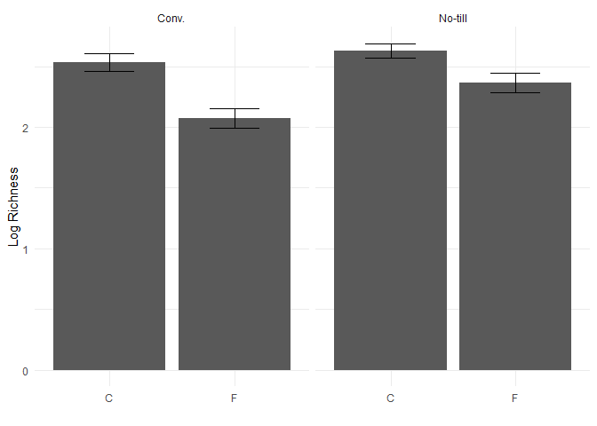

``` r
library(tidyverse)
```

    ## ── Attaching core tidyverse packages ──────────────────────── tidyverse 2.0.0 ──
    ## ✔ dplyr     1.1.4     ✔ readr     2.1.5
    ## ✔ forcats   1.0.0     ✔ stringr   1.5.1
    ## ✔ ggplot2   3.5.1     ✔ tibble    3.2.1
    ## ✔ lubridate 1.9.4     ✔ tidyr     1.3.1
    ## ✔ purrr     1.0.2     
    ## ── Conflicts ────────────────────────────────────────── tidyverse_conflicts() ──
    ## ✖ dplyr::filter() masks stats::filter()
    ## ✖ dplyr::lag()    masks stats::lag()
    ## ℹ Use the conflicted package (<http://conflicted.r-lib.org/>) to force all conflicts to become errors

``` r
microbiome.fungi <- read.csv("CodingChallenges\\Bull_richness.csv")
str(microbiome.fungi) 
```

    ## 'data.frame':    287 obs. of  16 variables:
    ##  $ SampleID       : chr  "Corn2017LeafObjective2Collection1T1R1CAH2" "Corn2017LeafObjective2Collection1T1R1CBA3" "Corn2017LeafObjective2Collection1T1R1CCB3" "Corn2017LeafObjective2Collection1T1R1FAC3" ...
    ##  $ Crop           : chr  "Corn" "Corn" "Corn" "Corn" ...
    ##  $ Objective      : chr  "Objective 2" "Objective 2" "Objective 2" "Objective 2" ...
    ##  $ Collection     : int  1 1 1 1 1 1 1 1 1 1 ...
    ##  $ Compartment    : chr  "Leaf" "Leaf" "Leaf" "Leaf" ...
    ##  $ DateSampled    : chr  "6/26/2017" "6/26/2017" "6/26/2017" "6/26/2017" ...
    ##  $ GrowthStage    : chr  "V6" "V6" "V6" "V6" ...
    ##  $ Treatment      : chr  "Conv." "Conv." "Conv." "Conv." ...
    ##  $ Rep            : chr  "R1" "R1" "R1" "R1" ...
    ##  $ Sample         : chr  "A" "B" "C" "A" ...
    ##  $ Fungicide      : chr  "C" "C" "C" "F" ...
    ##  $ Target_organism: chr  "Fungi" "Fungi" "Fungi" "Fungi" ...
    ##  $ Location       : chr  "Kellogg Biological Station" "Kellogg Biological Station" "Kellogg Biological Station" "Kellogg Biological Station" ...
    ##  $ Experiment     : chr  "LTER" "LTER" "LTER" "LTER" ...
    ##  $ Year           : int  2017 2017 2017 2017 2017 2017 2017 2017 2017 2017 ...
    ##  $ richness       : int  9 6 5 7 4 2 3 8 4 4 ...

1.  Select function \#### “select()”

- You can use this function to select only certain columns of your data

``` r
microbiome.fungi2 <- select(microbiome.fungi,SampleID,Crop, Compartment:Fungicide, richness)
#colon in btw comp and fungicide, can use this if have number of columns in order to select the columns "compartment through fungicide" 
```

2.  Filter function \#### “filter()”

- To filter out data by specific variables

``` r
#essentially does same thing a filter

head(filter(microbiome.fungi2,Treatment == "Conv.")) #filter this by where treatment is equal to conventional 
```

    ##                                    SampleID Crop Compartment DateSampled
    ## 1 Corn2017LeafObjective2Collection1T1R1CAH2 Corn        Leaf   6/26/2017
    ## 2 Corn2017LeafObjective2Collection1T1R1CBA3 Corn        Leaf   6/26/2017
    ## 3 Corn2017LeafObjective2Collection1T1R1CCB3 Corn        Leaf   6/26/2017
    ## 4 Corn2017LeafObjective2Collection1T1R1FAC3 Corn        Leaf   6/26/2017
    ## 5 Corn2017LeafObjective2Collection1T1R1FBD3 Corn        Leaf   6/26/2017
    ## 6 Corn2017LeafObjective2Collection1T1R1FCE3 Corn        Leaf   6/26/2017
    ##   GrowthStage Treatment Rep Sample Fungicide richness
    ## 1          V6     Conv.  R1      A         C        9
    ## 2          V6     Conv.  R1      B         C        6
    ## 3          V6     Conv.  R1      C         C        5
    ## 4          V6     Conv.  R1      A         F        7
    ## 5          V6     Conv.  R1      B         F        4
    ## 6          V6     Conv.  R1      C         F        2

``` r
#A more complex using &
head(filter(microbiome.fungi2, Treatment == "Conv." & Fungicide == "C")) #filtering by two conditions
```

    ##                                    SampleID Crop Compartment DateSampled
    ## 1 Corn2017LeafObjective2Collection1T1R1CAH2 Corn        Leaf   6/26/2017
    ## 2 Corn2017LeafObjective2Collection1T1R1CBA3 Corn        Leaf   6/26/2017
    ## 3 Corn2017LeafObjective2Collection1T1R1CCB3 Corn        Leaf   6/26/2017
    ## 4 Corn2017LeafObjective2Collection1T1R2CAF3 Corn        Leaf   6/26/2017
    ## 5 Corn2017LeafObjective2Collection1T1R2CBG3 Corn        Leaf   6/26/2017
    ## 6 Corn2017LeafObjective2Collection1T1R2CCH3 Corn        Leaf   6/26/2017
    ##   GrowthStage Treatment Rep Sample Fungicide richness
    ## 1          V6     Conv.  R1      A         C        9
    ## 2          V6     Conv.  R1      B         C        6
    ## 3          V6     Conv.  R1      C         C        5
    ## 4          V6     Conv.  R2      A         C        3
    ## 5          V6     Conv.  R2      B         C        8
    ## 6          V6     Conv.  R2      C         C        4

``` r
#Another more complex example using or | 
head(filter(microbiome.fungi2, Sample == "A" | Sample == "B")) #samples A or B
```

    ##                                    SampleID Crop Compartment DateSampled
    ## 1 Corn2017LeafObjective2Collection1T1R1CAH2 Corn        Leaf   6/26/2017
    ## 2 Corn2017LeafObjective2Collection1T1R1CBA3 Corn        Leaf   6/26/2017
    ## 3 Corn2017LeafObjective2Collection1T1R1FAC3 Corn        Leaf   6/26/2017
    ## 4 Corn2017LeafObjective2Collection1T1R1FBD3 Corn        Leaf   6/26/2017
    ## 5 Corn2017LeafObjective2Collection1T1R2CAF3 Corn        Leaf   6/26/2017
    ## 6 Corn2017LeafObjective2Collection1T1R2CBG3 Corn        Leaf   6/26/2017
    ##   GrowthStage Treatment Rep Sample Fungicide richness
    ## 1          V6     Conv.  R1      A         C        9
    ## 2          V6     Conv.  R1      B         C        6
    ## 3          V6     Conv.  R1      A         F        7
    ## 4          V6     Conv.  R1      B         F        4
    ## 5          V6     Conv.  R2      A         C        3
    ## 6          V6     Conv.  R2      B         C        8

3.  Mutate function \#### “mutate()”

- Allows us to quickly create new columns

``` r
microbiome.fungi2$logRich <- log(microbiome.fungi2$richness)  #is the same as:

#Create a new column called logRich
head(mutate(microbiome.fungi2, logRich = log(richness))) #format (dataset, name of column = function)
```

    ##                                    SampleID Crop Compartment DateSampled
    ## 1 Corn2017LeafObjective2Collection1T1R1CAH2 Corn        Leaf   6/26/2017
    ## 2 Corn2017LeafObjective2Collection1T1R1CBA3 Corn        Leaf   6/26/2017
    ## 3 Corn2017LeafObjective2Collection1T1R1CCB3 Corn        Leaf   6/26/2017
    ## 4 Corn2017LeafObjective2Collection1T1R1FAC3 Corn        Leaf   6/26/2017
    ## 5 Corn2017LeafObjective2Collection1T1R1FBD3 Corn        Leaf   6/26/2017
    ## 6 Corn2017LeafObjective2Collection1T1R1FCE3 Corn        Leaf   6/26/2017
    ##   GrowthStage Treatment Rep Sample Fungicide richness   logRich
    ## 1          V6     Conv.  R1      A         C        9 2.1972246
    ## 2          V6     Conv.  R1      B         C        6 1.7917595
    ## 3          V6     Conv.  R1      C         C        5 1.6094379
    ## 4          V6     Conv.  R1      A         F        7 1.9459101
    ## 5          V6     Conv.  R1      B         F        4 1.3862944
    ## 6          V6     Conv.  R1      C         F        2 0.6931472

``` r
#Creating a new column which combines Crop and Treatment
head(mutate(microbiome.fungi2, Crop_Treatment = paste(Crop, Treatment))) 
```

    ##                                    SampleID Crop Compartment DateSampled
    ## 1 Corn2017LeafObjective2Collection1T1R1CAH2 Corn        Leaf   6/26/2017
    ## 2 Corn2017LeafObjective2Collection1T1R1CBA3 Corn        Leaf   6/26/2017
    ## 3 Corn2017LeafObjective2Collection1T1R1CCB3 Corn        Leaf   6/26/2017
    ## 4 Corn2017LeafObjective2Collection1T1R1FAC3 Corn        Leaf   6/26/2017
    ## 5 Corn2017LeafObjective2Collection1T1R1FBD3 Corn        Leaf   6/26/2017
    ## 6 Corn2017LeafObjective2Collection1T1R1FCE3 Corn        Leaf   6/26/2017
    ##   GrowthStage Treatment Rep Sample Fungicide richness   logRich Crop_Treatment
    ## 1          V6     Conv.  R1      A         C        9 2.1972246     Corn Conv.
    ## 2          V6     Conv.  R1      B         C        6 1.7917595     Corn Conv.
    ## 3          V6     Conv.  R1      C         C        5 1.6094379     Corn Conv.
    ## 4          V6     Conv.  R1      A         F        7 1.9459101     Corn Conv.
    ## 5          V6     Conv.  R1      B         F        4 1.3862944     Corn Conv.
    ## 6          V6     Conv.  R1      C         F        2 0.6931472     Corn Conv.

4.  The pipe \#### “%\>%” The pipe allows you to string multiple
    commands together, and helps to visualize what you are doing to your
    data step by step.

- Allows you to input previous data from the right side of the pope into
  the function on the left (or next line)

``` r
#take orig dataset then the pipe: (do not need to define dataset in each command) 
microbiome.fungi %>% 
  select(SampleID, Crop, Compartment:Fungicide, richness) %>%  #selecting columns 
  filter(Treatment == "Conv.") %>%  #subsetting to only include the conventional treatment
  mutate(logRich = log(richness)) %>% #creating a new column of the log richness
  head() #display the first six rows 
```

    ##                                    SampleID Crop Compartment DateSampled
    ## 1 Corn2017LeafObjective2Collection1T1R1CAH2 Corn        Leaf   6/26/2017
    ## 2 Corn2017LeafObjective2Collection1T1R1CBA3 Corn        Leaf   6/26/2017
    ## 3 Corn2017LeafObjective2Collection1T1R1CCB3 Corn        Leaf   6/26/2017
    ## 4 Corn2017LeafObjective2Collection1T1R1FAC3 Corn        Leaf   6/26/2017
    ## 5 Corn2017LeafObjective2Collection1T1R1FBD3 Corn        Leaf   6/26/2017
    ## 6 Corn2017LeafObjective2Collection1T1R1FCE3 Corn        Leaf   6/26/2017
    ##   GrowthStage Treatment Rep Sample Fungicide richness   logRich
    ## 1          V6     Conv.  R1      A         C        9 2.1972246
    ## 2          V6     Conv.  R1      B         C        6 1.7917595
    ## 3          V6     Conv.  R1      C         C        5 1.6094379
    ## 4          V6     Conv.  R1      A         F        7 1.9459101
    ## 5          V6     Conv.  R1      B         F        4 1.3862944
    ## 6          V6     Conv.  R1      C         F        2 0.6931472

5.  Summarise \#### “summarise()” We can use this function to calculate
    mean, std dev and errors

``` r
microbiome.fungi %>% 
  select(SampleID, Crop, Compartment:Fungicide, richness) %>%  #selecting columns 
  filter(Treatment == "Conv.") %>%  #subsetting to only include the conventional treatment
  mutate(logRich = log(richness)) %>% #creating a new column of the log richness
  summarise(Mean.rich = mean(logRich)) #calculating overall mean log richness withing the conventionally merged treatment 
```

    ##   Mean.rich
    ## 1  2.304395

``` r
#This will only give one calculation, which is the average log(richness) 

microbiome.fungi %>% 
  select(SampleID, Crop, Compartment:Fungicide, richness) %>%  #selecting columns 
  filter(Treatment == "Conv.") %>%  #subsetting to only include the conventional treatment
  mutate(logRich = log(richness)) %>% #creating a new column of the log richness
  summarise(Mean.rich = mean(logRich), #calculating overall mean log richness withing the conventionally merged treatment 
            n=n(), #calculates the number of rows, give column name of n
            sd.dev = sd(logRich)) %>% #give column name sd.dev, calculate std.dev
  mutate(std.err = sd.dev/sqrt(n)) #mutate function to calculate std error 
```

    ##   Mean.rich   n    sd.dev   std.err
    ## 1  2.304395 144 0.7024667 0.0585389

6.  Group-by \#### “group_by()” Allows us to group data by a certain way

``` r
#CALUCLATE MEANS AND STD DEV FOR EACH TREATMENT AND FUNGICIDE
microbiome.fungi %>%
  select(SampleID, Crop, Compartment:Fungicide, richness) %>% # selecting columns
  group_by(Treatment, Fungicide) %>% # grouping by treatment and fungicide to later calculate summary stats by group
  mutate(logRich = log(richness)) %>% # creating a new column of the log richness
  summarise(Mean.rich = mean(logRich), # calculating the mean richness, stdeviation, and standard error
            n = n(), 
            sd.dev = sd(logRich)) %>%
  mutate(std.err = sd.dev/sqrt(n))
```

    ## `summarise()` has grouped output by 'Treatment'. You can override using the
    ## `.groups` argument.

    ## # A tibble: 4 × 6
    ## # Groups:   Treatment [2]
    ##   Treatment Fungicide Mean.rich     n sd.dev std.err
    ##   <chr>     <chr>         <dbl> <int>  <dbl>   <dbl>
    ## 1 Conv.     C              2.53    72  0.635  0.0748
    ## 2 Conv.     F              2.07    72  0.696  0.0820
    ## 3 No-till   C              2.63    72  0.513  0.0604
    ## 4 No-till   F              2.36    71  0.680  0.0807

#### Connnecting to plot

We can use pipes directly in a ggplot!

``` r
microbiome.fungi %>%
  select(SampleID, Crop, Compartment:Fungicide, richness) %>% # selecting columns
  group_by(Treatment, Fungicide) %>% # grouping by treatment and fungicide to later calculate summary stats by group
  mutate(logRich = log(richness)) %>% # creating a new column of the log richness
  summarise(Mean.rich = mean(logRich), # calculating the mean richness, stdeviation, and standard error
            n = n(), 
            sd.dev = sd(logRich)) %>%
  mutate(std.err = sd.dev/sqrt(n)) %>%
  #Adding in ggplot - Do not need to specify the data set since you specified at the top 
  ggplot(aes(x = Fungicide, y = Mean.rich)) + # adding in a ggplot
  geom_bar(stat="identity") +
  geom_errorbar( aes(x=Fungicide, ymin=Mean.rich-std.err, ymax=Mean.rich+std.err), width=0.4) +
  theme_minimal() +
  xlab("") +
  ylab("Log Richness") +
  facet_wrap(~Treatment)
```

    ## `summarise()` has grouped output by 'Treatment'. You can override using the
    ## `.groups` argument.

<!-- -->
\#### Joining Functions that allow you to combine multiple datasets
based on a common set of variables - left_join() - keep all rows of X
and add matching rows from Y. Any rows in Y that don’t match X are
excluded -right_join() -reverse of left_join() - inner_join() -only keep
rows that are common to both X and Y, remove everything else
-full_join() - keep any columns that are in either X or Y

``` r
# selecting just the richness and sample ID
richness <- microbiome.fungi %>%
  select(SampleID, richness)

# selecting columns that don't include the richness
metadata <- microbiome.fungi %>% 
  select(SampleID, Fungicide, Crop, Compartment, GrowthStage, Treatment, Rep, Sample)

head(metadata)
```

    ##                                    SampleID Fungicide Crop Compartment
    ## 1 Corn2017LeafObjective2Collection1T1R1CAH2         C Corn        Leaf
    ## 2 Corn2017LeafObjective2Collection1T1R1CBA3         C Corn        Leaf
    ## 3 Corn2017LeafObjective2Collection1T1R1CCB3         C Corn        Leaf
    ## 4 Corn2017LeafObjective2Collection1T1R1FAC3         F Corn        Leaf
    ## 5 Corn2017LeafObjective2Collection1T1R1FBD3         F Corn        Leaf
    ## 6 Corn2017LeafObjective2Collection1T1R1FCE3         F Corn        Leaf
    ##   GrowthStage Treatment Rep Sample
    ## 1          V6     Conv.  R1      A
    ## 2          V6     Conv.  R1      B
    ## 3          V6     Conv.  R1      C
    ## 4          V6     Conv.  R1      A
    ## 5          V6     Conv.  R1      B
    ## 6          V6     Conv.  R1      C

``` r
head(richness)
```

    ##                                    SampleID richness
    ## 1 Corn2017LeafObjective2Collection1T1R1CAH2        9
    ## 2 Corn2017LeafObjective2Collection1T1R1CBA3        6
    ## 3 Corn2017LeafObjective2Collection1T1R1CCB3        5
    ## 4 Corn2017LeafObjective2Collection1T1R1FAC3        7
    ## 5 Corn2017LeafObjective2Collection1T1R1FBD3        4
    ## 6 Corn2017LeafObjective2Collection1T1R1FCE3        2

``` r
#Can join these two dataframes by common column == SampleID

head(left_join(metadata,richness, by= "SampleID")) #adding the richness data to the metadata based on the common column of sampleID 
```

    ##                                    SampleID Fungicide Crop Compartment
    ## 1 Corn2017LeafObjective2Collection1T1R1CAH2         C Corn        Leaf
    ## 2 Corn2017LeafObjective2Collection1T1R1CBA3         C Corn        Leaf
    ## 3 Corn2017LeafObjective2Collection1T1R1CCB3         C Corn        Leaf
    ## 4 Corn2017LeafObjective2Collection1T1R1FAC3         F Corn        Leaf
    ## 5 Corn2017LeafObjective2Collection1T1R1FBD3         F Corn        Leaf
    ## 6 Corn2017LeafObjective2Collection1T1R1FCE3         F Corn        Leaf
    ##   GrowthStage Treatment Rep Sample richness
    ## 1          V6     Conv.  R1      A        9
    ## 2          V6     Conv.  R1      B        6
    ## 3          V6     Conv.  R1      C        5
    ## 4          V6     Conv.  R1      A        7
    ## 5          V6     Conv.  R1      B        4
    ## 6          V6     Conv.  R1      C        2

#### Pivoting

long data -\> one observation per sample or per row wide data -\>
multiple observations per row \*wide-data is not wrong per say, but in
general we want long-data

``` r
#Set up data frame
microbiome.fungi %>%
  select(SampleID, Crop, Compartment:Fungicide, richness) %>% # selecting columns  filter(Class == "Sordariomycetes") %>%
  group_by(Treatment, Fungicide) %>% # grouping by treatment and fungicide to later calculate summary stats by group
  summarise(Mean = mean(richness)) # calculates the mean per Treatment and Fungicide 
```

    ## `summarise()` has grouped output by 'Treatment'. You can override using the
    ## `.groups` argument.

    ## # A tibble: 4 × 3
    ## # Groups:   Treatment [2]
    ##   Treatment Fungicide  Mean
    ##   <chr>     <chr>     <dbl>
    ## 1 Conv.     C         14.6 
    ## 2 Conv.     F          9.75
    ## 3 No-till   C         15.4 
    ## 4 No-till   F         13.1

``` r
#Change from long format (above) to wide format 
#Change dataset to this: two columns C anf F column for fungicide -- we want names from fungicide column to be put in new columns 
#values input to be taken from mean column
microbiome.fungi %>%
  select(SampleID, Crop, Compartment:Fungicide, richness) %>% # selecting columns  filter(Class == "Sordariomycetes") %>%
  group_by(Treatment, Fungicide) %>% # grouping by treatment and fungicide to later calculate summary stats by group
  summarise(Mean = mean(richness)) %>% # calculates the mean per Treatment and Fungicide 
  pivot_wider(names_from = Fungicide, values_from = Mean) # pivot to wide format
```

    ## `summarise()` has grouped output by 'Treatment'. You can override using the
    ## `.groups` argument.

    ## # A tibble: 2 × 3
    ## # Groups:   Treatment [2]
    ##   Treatment     C     F
    ##   <chr>     <dbl> <dbl>
    ## 1 Conv.      14.6  9.75
    ## 2 No-till    15.4 13.1

Now we can easily take the difference between the fungicide and control

``` r
microbiome.fungi %>% 
  select(SampleID, Crop, Compartment:Fungicide, richness ) %>%  #selecting columns 
  group_by(Treatment, Fungicide) %>%  #grouping by treatment and fungicide to later calc summary stats by grp 
  summarise(Mean = mean(richness)) %>% # calculates the mean per Treatment and Fungicide
  pivot_wider(names_from = Fungicide, values_from = Mean) %>%  #pivot to wide format
  mutate(diff.fungicide= C-F) # calculate the diff btw the means 
```

    ## `summarise()` has grouped output by 'Treatment'. You can override using the
    ## `.groups` argument.

    ## # A tibble: 2 × 4
    ## # Groups:   Treatment [2]
    ##   Treatment     C     F diff.fungicide
    ##   <chr>     <dbl> <dbl>          <dbl>
    ## 1 Conv.      14.6  9.75           4.89
    ## 2 No-till    15.4 13.1            2.32
